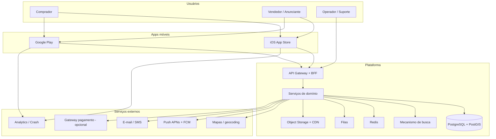
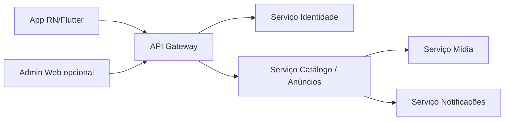
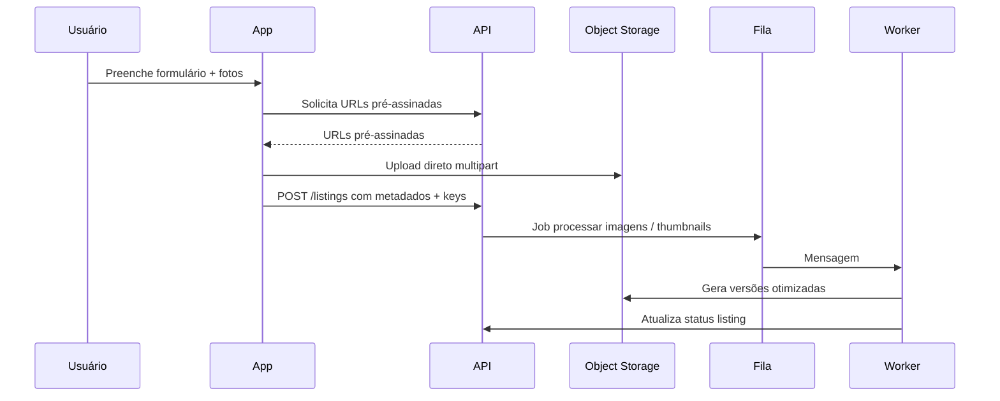

# Arquitetura do sistema — tecnologias, componentes e diagramas

## 1. Objetivos arquiteturais

- **Disponibilidade** para picos de leitura (listagens e busca).
- **Baixa latência** percebida no app (cache, CDN, imagens otimizadas).
- **Segurança** em profundidade (auth, autorização, rate limiting, auditoria).
- **Evolução** sem rewrite: módulos claros (catálogo, identidade, mídia, notificações).

## 2. Stack sugerida (referência — ajustar ao nicho e time)

| Camada | Opção A (alto ecossistema JS) | Opção B (performance UI) |
|--------|------------------------------|----------------------------|
| App móvel | **React Native** + TypeScript | **Flutter** + Dart |
| Backend API | **Node.js (NestJS)** ou **.NET 8** | **Go** (chi/echo) ou **.NET** |
| Banco transacional | **PostgreSQL 16+** + **PostGIS** (geo) | Idem |
| Busca / facets | **OpenSearch** ou **Meilisearch** (MVP) | Evoluir conforme volume |
| Cache | **Redis** | Idem |
| Filas / jobs | **SQS** ou **RabbitMQ** / **Redis Streams** | Conforme cloud |
| Object storage | **S3-compatível** (AWS / MinIO dev) | Idem |
| CDN | **CloudFront** / **Cloudflare** | Idem |
| IdP | **Cognito**, **Auth0**, **Keycloak** (self-host) | Decisão por custo/compliance |
| Observabilidade | **OpenTelemetry** + **Grafana** + **Loki** ou Datadog | — |
| CI/CD | **GitHub Actions** + deploy em **ECS/Kubernetes** ou **Cloud Run** | — |

## 3. Diagrama de contexto (C4 — nível 1)

## 4. Diagrama de containers (C4 — nível 2, simplificado)

## 5. Fluxo resumido: publicação de anúncio com mídia

## 6. Estratégia de API

- **REST** ou **GraphQL** (REST costuma ser mais simples para apps com cache HTTP).
- Versionamento: `/v1/...`.
- **OpenAPI** publicado internamente; contratos testados em CI.
- **BFF** (Backend for Frontend) opcional: útil se app e admin divergirem muito.

## 7. Multi-tenant e escopo nacional

- Particionamento lógico por **estado/município** e coordenadas para raio.
- **CDN** com política de cache apenas para assets públicos (imagens publicadas).
- Dados pessoais: minimização; logs sem PII.

## 8. Ambientes

- `dev` → `staging` (espelho de prod com dados mascarados) → `prod`.
- Feature flags para liberar gradualmente (ex.: novo filtro, novo nicho).

## 9. Telas no contexto da arquitetura

Cada tela consome principalmente:

- **Catálogo**: listagens, filtros, detalhe.
- **Identidade**: login, perfil, favoritos.
- **Mídia**: galeria, upload.
- **Notificações**: alertas de preço, novos itens na região (fase posterior com consentimento).

Detalhamento de telas: ver [04-especificacao-funcional-telas.md](./04-especificacao-funcional-telas.md).

## 10. Decisões a registrar (ADR)

Recomenda-se pasta `docs/adr/` com decisões curtas, por exemplo:

- ADR-001: PostGIS vs busca apenas por cidade.
- ADR-002: OpenSearch vs Meilisearch no MVP.
- ADR-003: React Native vs Flutter (critérios: time, performance, libs do nicho).
