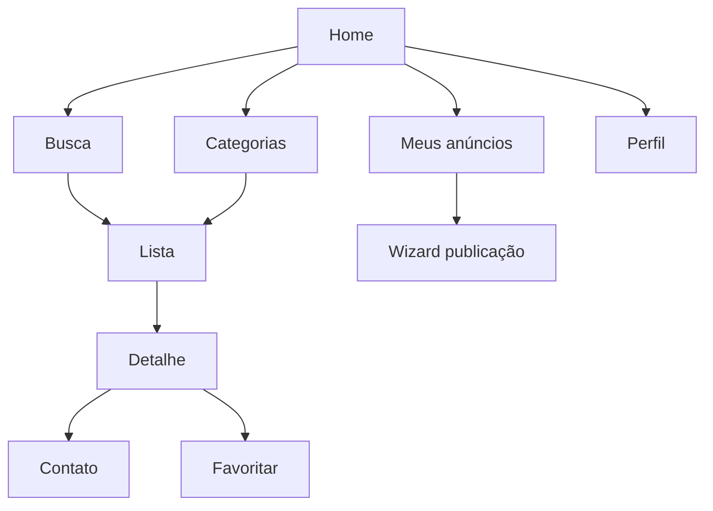

# UX/UI — princípios, telas e design system (rascunho)

## 1. Princípios de experiência (marketplace nacional)

1. **Confiança antes de conversão**: fotos nítidas, dados do vendedor claros, denúncia visível mas discreta.
2. **Filtros sem labirinto**: poucos toques até resultado relevante; mostrar **chips** de filtros ativos.
3. **Performance percebida**: skeletons, paginação infinita com “memo” de posição ao voltar da lista.
4. **Acessibilidade**: contraste AA, tamanhos tocáveis ≥ 44pt, suporte a leitores de tela nos fluxos críticos.
5. **Consistência entre iOS e Android**: respeitar guidelines (Human Interface / Material 3) onde conflitarem com marca.

## 2. Information architecture (mapa mental)

## 3. Padrões de UI por área

### 3.1 Home

- Barra de busca persistente.
- Carrossel de categorias (ícone + label).
- Seções: “Perto de você” (se consentimento), “Recentes”, “Destaques patrocinados” (fase posterior).

### 3.2 Lista + filtros

- **Filtro primário**: localização (UF → cidade ou raio).
- **Filtro secundário**: modelo/atributo (dependente da categoria: ex. ano, versão, cor).
- **Toolbar**: ordenação e alternância lista/mapa (mapa em MMP).

### 3.3 Detalhe

- Galeria com zoom; indicador de posição.
- Bloco “Ficha técnica” (atributos chave).
- CTA fixo inferior: **Contatar** / **Ligar** / **WhatsApp** (definir política de exposição de telefone). **Não** incluir “Comprar” ou “Pagar no app” neste modelo — o fechamento é **externo**; o copy deve deixar isso claro para evitar expectativa errada do usuário.
- Ações secundárias: favoritar, compartilhar, denunciar.

### 3.4 Wizard de publicação

- Barra de progresso (passos 1/4 … 4/4).
- Validação inline; não bloquear avanço sem mensagem clara.
- Preview final com “como o comprador vê”.

## 4. Design system (mínimo viável)

### 4.1 Fundações

- **Tipografia**: 2 famílias no máximo (display + corpo); escalas 12–28.
- **Cores**: primária, secundária, superfície, erro, sucesso; modo escuro planejado desde o início.
- **Espaçamento**: grade 4/8 px; grid de cards 2 colunas em telas pequenas se fizer sentido ao nicho.

### 4.2 Componentes reutilizáveis

- AppBar com busca.
- `ListingCard` (imagem, título, preço, local, badge “novo”).
- `FilterChip`, `FilterSheet`.
- `PhotoUploader` com reorder drag.
- `EmptyState` ilustrado por fluxo (sem resultados vs sem favoritos).
- `ErrorState` com retry.

### 4.3 Estados obrigatórios por tela

- Loading, empty, error, offline (mensagem + retry quando API indisponível).

## 5. Microcopy (tom)

- Tom **profissional e direto**; evitar jargão interno (“listing_id”).
- Mensagens de erro humanas: “Não foi possível carregar os resultados. Toque para tentar de novo.”

## 6. Acessibilidade (checklist)

- Rotular botões de ícone (`accessibilityLabel`).
- Foco lógico em modais/sheets.
- Não depender só de cor para status (usar ícone/texto).

## 7. Handoff para design visual

Entregar ao designer:

- Personas e jornadas (ver [04-especificacao-funcional-telas.md](./04-especificacao-funcional-telas.md)).
- Wireframes low-fi das telas T10–T14 e T30–T35.
- Restrições técnicas: ratio de imagem, limite de fotos, latência alvo.

## 8. Pesquisa com usuários (MMP)

- Teste moderado **5 usuários** por persona nos fluxos busca→detalhe e publicação.
- Ajustar taxonomia de **modelo/atributos** com base em linguagem real dos usuários.
