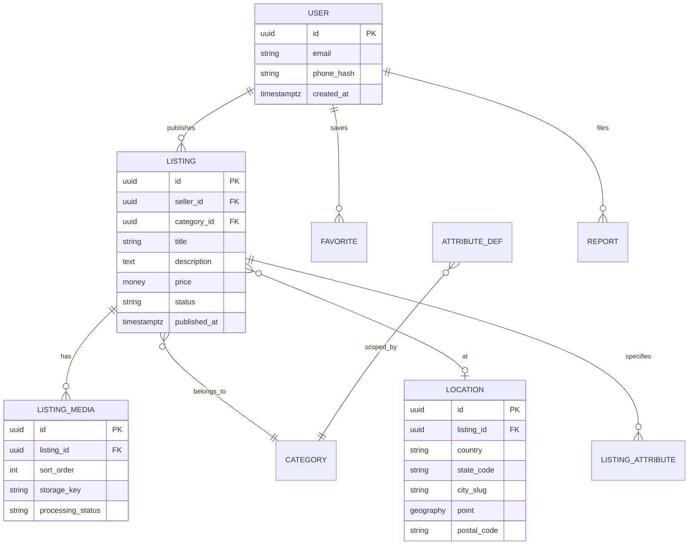

# Modelo de dados e perspectiva DBA

## 1. Requisitos de dados do negócio

- Cadastro de **usuários** e perfis (comprador/vendedor podem ser o mesmo).
- **Anúncios** com atributos dinâmicos por **categoria** (carros têm modelo/ano; outro nicho terá outra taxonomia).
- **Localização**: hierarquia administrativa (UF, município) e/ou ponto geográfico (lat/lon) + opcional CEP.
- **Mídia**: N fotos por anúncio, com ordem e processamento (original, thumbnail, webp).
- **Engajamento**: favoritos, visualizações (agregadas), denúncias.

## 2. Modelo conceitual (entidades principais)

## 3. Estratégia de localização

### Opção A — somente UF/município (MVP rápido)

- Colunas `state_code`, `city_ibge_code` (ou slug), índice composto com `category_id` e `status`.
- Menor risco LGPD; busca simples.

### Opção B — PostGIS (raio / mapa)

- Coluna `geog GEOGRAPHY(POINT,4326)` em `location` ou `listing`.
- Índice **GiST** em `geog`.
- Queries: `ST_DWithin(geog, center, radius_m)`.
- Exigir UX de consentimento para usar GPS do aparelho.

## 4. Busca e filtros

- **Transacional**: Postgres para writes e leitura por ID.
- **Busca facetada** (texto + filtros + ordenação):
  - MVP: Postgres (`tsvector`, índices GIN) se volume moderado.
  - Escala: **OpenSearch** com documento desnormalizado por anúncio + workers de sync via fila (evento: listing.created/updated).

### Campos típicos no documento de busca

- `title`, `description` (pesos diferentes), `category_path`, `state`, `city`, `price`, `created_at`, `geo`, `model_slug`, atributos facetáveis.

## 5. Índices críticos (exemplos Postgres)

- `listings(status, category_id, published_at DESC)` — feed por categoria.
- `listings` + `location` join com índice em `listing_id`.
- Full-text: índice GIN em `to_tsvector('portuguese', title || ' ' || description)` se busca PT-BR.

## 6. Consistência e concorrência

- Publicação de anúncio: transação curta + job assíncrono para thumbnails e indexação.
- **Optimistic locking** (`version` ou `updated_at`) em edições concorrentes.
- Idempotência em webhooks apenas se houver integrações futuras (ex.: **assinatura** do anunciante via gateway — fora do escopo da **compra C2C**, que permanece externa).

## 7. Retenção e LGPD

- Soft delete em `users` com job de anonimização após prazo legal acordado.
- Logs operacionais sem e-mail em texto claro (hash ou token interno).

## 8. Performance e capacidade

- Pool de conexões (PgBouncer) em produção.
- Particionamento de tabelas grandes (`listing_events`, `impressions`) por mês — quando métricas justificarem.
- **Vacuum** autovacuum ajustado para tabelas quentes.

## 9. DR / backup

- RPO/RTO definidos com cliente (ex.: RPO 24h, RTO 4h para MVP).
- Snapshots automáticos + `pg_dump` lógico para portability.

## 10. Migrações

- Ferramentas: Flyway, Liquibase, Prisma migrate, Atlas — padronizar uma.
- Política: migrações **backward compatible** entre deploys (expand/contract).
