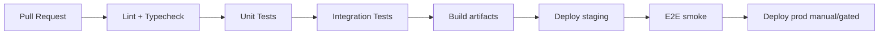

# Qualidade de código, testes e entrega contínua

## 1. Definição de pronto (Definition of Done)

Um incremento só é “pronto” quando:

1. Código revisado (pelo menos 1 aprovação) com checklist de segurança básica.
2. Testes automatizados pertinentes passando no CI.
3. Documentação de API atualizada (OpenAPI) quando endpoints mudam.
4. Feature flag ou config documentada, se aplicável.
5. Métricas/alertas mínimos para fluxos críticos novos (erro 5xx, latência).

## 2. Padrões de código

- **Linguagem**: TypeScript estrito no app e no backend (ou equivalente no stack escolhido).
- **Lint + format**: ESLint + Prettier (JS) / `dart analyze` (Flutter) / EditorConfig.
- **Commits**: Conventional Commits (feat/fix/chore) para changelog automático.
- **Branches**: trunk-based ou GitFlow simplificado; `main` sempre deployável.

## 3. Pirâmide de testes

| Nível | Escopo | Meta de cobertura |
|-------|--------|-------------------|
| Unitário | Funções puras, validadores, mappers | Alta nos núcleos de domínio |
| Integração | API + banco (testcontainers) | Fluxos CRUD principais |
| Contrato | Consumidor/produtor OpenAPI | Endpoints públicos |
| E2E (app) | Fluxos felizes críticos | Poucos, estáveis (Maestro, Detox) |

**Anti-padrão**: E2E cobrindo tudo → CI lento e flaky.

## 4. Casos de teste mínimos (exemplos)

- Publicação: criar rascunho → adicionar 3 fotos → publicar → aparece na busca.
- Filtro: combinação estado + modelo retorna subset correto (dados seed).
- Permissão: usuário A não edita anúncio de usuário B (403).

## 5. CI/CD

- Gates: falha de segurança SCA crítica bloqueia merge.
- **Semantic versioning** do app (stores) independente do backend.

## 6. Observabilidade como qualidade

- **Tracing** em cadeia: app → API → DB/search.
- Dashboards: taxa de erro por endpoint, p95 latência, fila atrasada.
- Crash-free sessions (Firebase Crashlytics / Sentry).

## 7. Revisão de dependências

- Renovate ou Dependabot habilitado.
- Política de atualização de major: planejamento + testes E2E smoke.

## 8. Definition of Ready (para tickets)

- Critério de aceite testável.
- Mock de dados ou seed referenciado.
- Impacto em analytics/feature flags descrito.

## 9. Dívida técnica

- Registrar dívida com impacto (performance, segurança, DX) e data de revisita.
- Timebox: ex.: 10% de cada sprint para redução de dívida “alto impacto”.
