# Documento 3 — Arquitetura (rascunho com tecnologias)

## Diagrama lógico (Mermaid)

```mermaid
flowchart TB
  subgraph Clientes
    AppContratante[App Mobile Contratante]
    AppPrestador[App Mobile Prestador]
  end

  subgraph Edge
    CDN[CDN Imagens]
    APIGW[API Gateway / BFF]
  end

  subgraph Core
    Auth[Serviço Auth OIDC]
    Users[Perfis Usuários]
    Catalog[Catálogo Categorias Serviços]
    Geo[Busca Geo Prestadores]
    Media[Upload e Processamento Mídia]
    Subs[Assinaturas Prestador]
    Match[Matching Feed Cartões]
    Jobs[Agendamentos Jobs]
    Chat[Chat Mensagens]
    Reviews[Avaliações e Depoimentos]
    Notif[Notificações Push]
    Fraud[Antifraude Regras]
    Admin[Backoffice Admin Web]
  end

  subgraph Dados
    PG[(PostgreSQL PostGIS)]
    Redis[(Redis Cache Fila)]
    OBJ[(Object Storage S3 compatível)]
    ES[(Opcional OpenSearch)]
  end

  subgraph Pagamentos
    PSP[Gateway PSP Stripe Pagar.me etc]
    Webhook[Webhooks Assinatura e Pagamentos]
  end

  subgraph Observabilidade
    Logs[Logs estruturados]
    Metrics[Métricas]
    Traces[Tracing]
  end

  AppContratante --> CDN
  AppPrestador --> CDN
  AppContratante --> APIGW
  AppPrestador --> APIGW
  Admin --> APIGW

  APIGW --> Auth
  APIGW --> Users
  APIGW --> Catalog
  APIGW --> Geo
  APIGW --> Media
  APIGW --> Subs
  APIGW --> Match
  APIGW --> Jobs
  APIGW --> Chat
  APIGW --> Reviews
  APIGW --> Notif

  Geo --> PG
  Users --> PG
  Catalog --> PG
  Reviews --> PG
  Jobs --> PG
  Chat --> PG
  Subs --> PSP
  Webhook --> Subs

  Media --> OBJ
  Notif --> Redis
  Match --> Redis
  Fraud --> Redis

  Core --> Logs
  Core --> Metrics
  Core --> Traces
```

## Stack sugerida (exemplo coerente)

- **Mobile:** React Native ou Flutter (um codebase iOS+Android); mapas: Mapbox ou Google Maps Platform.
- **Backend:** Node NestJS ou .NET ou Go; **API** REST/GraphQL; filas com **Redis** ou SQS/RabbitMQ.
- **Dados:** **PostgreSQL + PostGIS** (geo); Redis; object storage (S3/R2).
- **Auth:** Cognito, Auth0, Firebase Auth ou Keycloak.
- **Pagamentos/assinatura:** Stripe, Pagar.me, etc. (webhooks idempotentes).
- **Infra:** AWS/GCP/Azure ou Render/Fly + managed DB; **IaC** Terraform.
- **Admin:** Next.js ou Retool (fase inicial).

## Observação

Esta stack é **exemplo**; a escolha final depende do time, orçamento e requisitos não funcionais (latência, auditoria, contratos com cloud).
